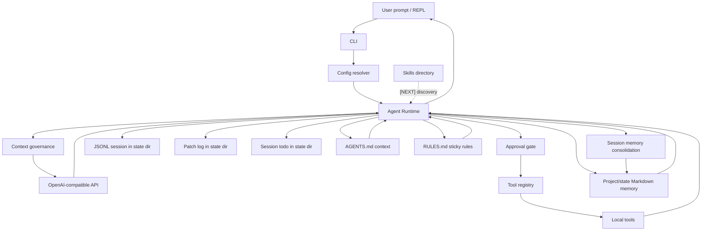

# Local Coding Agent 架构设计

更新时间：2026-07-08

本文档描述 `local-coding-agent` 当前架构基线，以及按技术成熟度划分的待加入能力。它是给后续实现者和协作 Agent 读取的架构视图；项目进度事实源仍以 `docs/project-status.md` 和 `docs/project-management.md` 为准。

## 状态标签

| 标签 | 含义 | 架构处理方式 |
|---|---|---|
| `[CORE-已落地]` | 主链路稳定可用，有测试或真实运行验证。 | 作为后续设计依赖，不轻易推翻。 |
| `[MVP-已落地]` | 第一版已可用，但能力故意轻量。 | 允许按真实任务反馈继续增强。 |
| `[WIP-增强中]` | 局部能力已有，关键闭环还缺一段。 | 优先补齐闭环，不做大范围重构。 |
| `[NEXT-近期待加入]` | 与当前 P7 目标直接相关，设计已基本明确。 | 大猛或后续会话可直接按任务拆实现。 |
| `[LATER-后续候选]` | 有价值，但会显著增加复杂度。 | 先保留接口空间，不抢当前阶段。 |
| `[DEFER-暂缓]` | 方向合理，但当前收益不足或依赖条件不成熟。 | 不进入近期排期。 |
| `[OUT-阶段外]` | 与第一阶段本地、封闭 VM、单 Agent 边界冲突。 | 明确不做，除非项目目标改变。 |

## 架构目标

第一阶段目标是一个个人本地编程助手：

- 运行在本机或封闭 VM。
- 只访问用户指定的 OpenAI-compatible AI API。
- 能读取、搜索、修改本地代码。
- 能运行本地命令和测试。
- 能生成 diff，并把修改过程记录到本地 session。
- 能沉淀可审计的项目记忆。
- 默认不联网搜索、不自动下载依赖、不做远程控制、不做多 Agent。

核心约束：

- 本地优先：workspace 是默认安全边界。
- 单 Agent 优先：先把一个 Agent 的日用能力做稳。
- 可审计优先：写入、执行、审批、回滚都要有本地记录。
- OMP 思路本地化：吸收 approval、context compaction、default workflow、memory/skills 的成熟设计，但避免引入当前阶段不需要的外部依赖。

## 总体分层

| 层 | 状态 | 职责 | 当前实现 |
|---|---|---|---|
| 用户入口层 | `[CORE-已落地]` | CLI、REPL、一次性 prompt、继续会话。 | `./agent`、`src/local_agent/cli.py`。 |
| 配置层 | `[CORE-已落地]` | 合并 CLI、环境变量、JSON config、provider preset、approval、summary、memory consolidation、预算、allowed dirs。 | `src/local_agent/config.py`。 |
| Agent Runtime | `[CORE-已落地]` | system prompt、模型循环、工具分发、deadline、synthetic tool result、workflow nudge、重复工具 forced-final steering。 | `src/local_agent/agent.py`。 |
| Provider 层 | `[CORE-已落地]` | OpenAI-compatible chat completions，对接百炼和通用 endpoint。 | `src/local_agent/llm.py`。 |
| 工具系统 | `[CORE-已落地]` | 工具注册、schema、tier、approval policy、参数校验、错误包装。 | `src/local_agent/tools/base.py`。 |
| 本地工具层 | `[CORE-已落地]` | 文件、搜索、shell/test、git、patch、rollback、memory、learn、todo、ask_user。 | `src/local_agent/tools/`。 |
| 上下文治理 | `[MVP-已落地]` | OMP 风格 reserve、auto/local/llm summary、recent 保留、tool 输出截断、单 system message。 | `AgentRuntime._messages_for_model()`。 |
| Context / Rules | `[MVP-已落地]` | Workspace roots、用户级/项目级 `AGENTS.md` 启动注入，`RULES.md` 每轮 sticky 注入。 | `--cwd`、`--allow-dir`、`~/.config/local-coding-agent/`、`.local-agent/`。 |
| 轻量代码导航 | `[MVP-已落地]` | Python、Java、JS、TS、Vue 的 symbols/definition/references/diagnostics。 | `src/local_agent/tools/lsp.py`。 |
| 本地持久化 | `[CORE-已落地]` | JSONL session、patch log、todo、Markdown memory。 | runtime state 默认在用户级 state dir；显式项目 memory/skills 在 `.local-agent/`，自动 consolidation 默认写 state memory。 |
| Memory / Skills | `[MVP-已落地]` | Markdown memory 启动注入、learn、可选 session memory consolidation 和 authored skills discovery 已落地；managed skills 待评估。 | `docs/memory-skills-implementation-plan.md`。 |
| 项目管理视图 | `[CORE-已落地]` | Markdown 事实源和 Excel 人工视图。 | `docs/project-management.md`、同步脚本。 |

## 执行流程



## 已落地能力矩阵

| 能力域 | 标签 | 当前能力 | 架构说明 |
|---|---|---|---|
| CLI / REPL | `[CORE-已落地]` | 一次性 prompt、REPL、`--continue`、指定 session、隐藏工具日志。 | CLI 只负责输入和配置组装，业务逻辑留在 Runtime。 |
| Provider | `[CORE-已落地]` | `bailian`、`bailian-intl`、通用 OpenAI-compatible。 | 第一阶段只访问配置的 AI API，不加入公网搜索。 |
| Agent loop | `[CORE-已落地]` | 模型请求、工具调用循环、`finish_reason=length` 处理、deadline 停止、重复工具后强制最终回答。 | `max_steps=0` 默认不限步，靠时间预算和模型自然结束控制；重复同参工具命中阈值后，下一轮可发送 `tools=[]` 促使模型从已有证据回答。 |
| 默认工作流 | `[MVP-已落地]` | system prompt 和 runtime workflow nudge 会引导探索、todo、patch preview、验证、diff。 | 借鉴 OMP 分层设计，先用轻量 steering 替代完整 ToolChoiceQueue。 |
| 工具注册 | `[CORE-已落地]` | OpenAI function schema、运行时参数校验、tier 分类。 | tier 是 approval 的基础：read/state/interaction/write/exec。 |
| Approval | `[CORE-已落地]` | `always-ask`、`write`、`yolo`；每工具 `allow/prompt/deny`；session allow/reject；REPL `/approval`。 | 配置级 `prompt/deny` 是硬护栏，不被 session allow 绕过。 |
| 文件读取 | `[CORE-已落地]` | workspace 或显式 allowed dir 内读文件，返回 hash tag 和行号，限制大文件和二进制。 | 写入前必须先读，给 anchored patch 提供校验锚点。 |
| Multi-root | `[MVP-已落地]` | `--allow-dir` / `AGENT_ALLOWED_DIRS` 显式授权额外目录，并把 workspace roots 注入模型上下文。 | 文件、搜索、LSP、patch 工具可访问额外目录；shell、git、project memory/skills 仍锚定 `--cwd`，session/todo/patch logs 和默认 consolidation memory 走 state dir。 |
| Anchored patch | `[CORE-已落地]` | `replace`、`insert_before`、`insert_after`、`dry_run`。 | 依靠 path、hash tag、line range、old_text 多重校验。 |
| Patch rollback | `[MVP-已落地]` | 回滚当前 session 中由 `apply_patch` 写入的补丁。 | 以 patch log 和 after tag 校验避免误回滚用户后续修改。 |
| 搜索 | `[CORE-已落地]` | `search_code` 调用 `rg`，结果使用 workspace 相对路径。 | 作为 LSP 轻量导航之外的通用兜底。 |
| Shell / Tests | `[CORE-已落地]` | `shell`、`run_tests`，带 timeout、budget clamp、危险命令拒绝。 | shell 不是沙箱，真正隔离依赖封闭 VM 和审批。 |
| Git | `[CORE-已落地]` | `git_status`、`git_diff`。 | 作为最终交付摘要和人工 review 的证据。 |
| Runtime state | `[CORE-已落地]` | `--state-dir` / `AGENT_STATE_DIR`，默认 `${XDG_STATE_HOME:-~/.local/state}/local-coding-agent/workspaces/<workspace-key>/`。 | 对齐 OMP，把运行转录与目标源码目录分层，避免只读跨项目分析污染目标仓库。 |
| Session | `[CORE-已落地]` | state dir 下的 `sessions/*.jsonl`，支持坏尾部恢复。 | session 是对话事实，不承担长期 memory 职责。 |
| Todo | `[MVP-已落地]` | `todo_read/add/update`，状态保存在 state dir 下的 session 维度。 | 用于长任务进度和 compaction 后恢复上下文。 |
| Startup context | `[MVP-已落地]` | 用户级 `AGENTS.md` 和项目级 `.local-agent/AGENTS.md` 启动注入。 | 常驻上下文是 advisory；项目上下文在用户上下文之后，更贴近当前 workspace。 |
| Sticky rules | `[MVP-已落地]` | 用户级 `RULES.md` 和项目级 `.local-agent/RULES.md` 在每次 provider request 前注入。 | 用于短规则，避免长会话/compaction 后丢失关键操作约束。 |
| ask_user | `[MVP-已落地]` | 支持 `timeout_seconds`、`default_answer`、deadline clamp。 | 只在需求歧义影响结果时使用。 |
| Context compaction | `[MVP-已落地]` | `auto/local/llm` summary，recent 保留，tool 输出只在发给模型副本中截断。 | 当前以字符预算近似 token，保留 OMP reserve 思路。 |
| Light LSP | `[MVP-已落地]` | symbols、definition、references、diagnostics。 | 不启动外部 language server，封闭 VM 友好。 |
| Markdown memory | `[MVP-已落地]` | `memory_read/write` 读写项目 project/decisions/conventions/learned；启动时同时注入项目 memory 和 state memory。 | 当前用户指令和最新源码证据优先。 |
| Learn | `[MVP-已落地]` | `learn` 将可复用经验写入 `.local-agent/memory/learned.md`。 | tier=`write`，默认需要审批，不自动学习。 |
| Memory consolidation | `[MVP-已落地]` | `--memory-consolidation auto|llm` 在一轮结束后抽取 session 中的长期经验；默认 `--memory-scope state` 写 state dir 的 `memory/*.md`，显式 `project` 才写 `.local-agent/memory/*.md`。 | 默认 `off`；坏 JSON、空结果、预算耗尽或本轮已显式写 memory 时不写入。 |
| Authored skills discovery | `[MVP-已落地]` | 启动时扫描 `.local-agent/skills/<name>/SKILL.md`。 | 只注入 name、description 和 source path；正文按需用 `read_file` 读取。 |

## 待加入能力矩阵

| 能力 | 标签 | 建议落点 | 设计要点 | 验收标准 |
|---|---|---|---|---|
| Context token 预算 | `[NEXT-近期待加入]` | Context governance。 | 在字符预算外加入模型相关 token 估算，保留字符 fallback。 | 长上下文压测中 compaction 触发更接近真实 context window。 |
| Path-scoped rules | `[NEXT-近期待加入]` | Context / Rules。 | 支持按路径/glob 生效的规则文件，避免全局 sticky rules 对无关目录造成噪音。 | 编辑匹配路径时规则可见；不匹配路径时不注入或只作为可读取提示。 |
| Managed skills / autolearn | `[LATER-后续候选]` | Skills 子系统。 | 默认关闭；generated skills 与 authored skills 隔离，优先级最低，需审计。 | 不影响 authored skills，且能清楚区分人工与自动生成来源。 |
| 完整外部 LSP adapter | `[LATER-后续候选]` | 可选后台进程层。 | 作为 light LSP 的增强，不替换当前静态工具；按语言和依赖可用性启用。 | 支持更准确定义、rename、code action，但无依赖时自动降级。 |
| AST edit / refactor | `[LATER-后续候选]` | Patch 层增强。 | 先保留 anchored patch 主路径，再评估 Python/TS 局部 AST 修改。 | 能降低大规模重构误改率，同时保留 diff 和回滚。 |
| Reviewer / planner 角色 | `[LATER-后续候选]` | Runtime 内部策略或未来 subagent。 | 先做单 Agent 的轻量 review prompt，不急于多 Agent 并发。 | 对高风险改动能给出更稳定的自检清单。 |
| TUI | `[DEFER-暂缓]` | UI 层。 | 当前 CLI 足够验证核心能力；TUI 等稳定后再做。 | 需要明确日用交互痛点后再进入排期。 |
| DAP | `[DEFER-暂缓]` | 调试工具层。 | 依赖语言生态和进程管理，当前收益低于 LSP / memory。 | 有真实调试场景后再设计。 |
| Browser / Web search | `[OUT-阶段外]` | 不加入第一阶段。 | 与封闭 VM、本地优先和无公网搜索目标冲突。 | 项目目标改变前不做。 |
| MCP / 插件市场 | `[OUT-阶段外]` | 不加入第一阶段。 | 会扩大外部依赖和权限面。 | 等本地核心稳定后重新评估。 |
| 自动下载依赖 | `[OUT-阶段外]` | 不加入第一阶段。 | 封闭 VM 场景下不可假设公网可用，也有供应链风险。 | 只允许用户显式安装或预置依赖。 |
| 远程仓库控制 | `[OUT-阶段外]` | 不加入第一阶段。 | 当前只做本地 git status/diff，不自动推送或开 PR。 | 需要单独权限模型后再议。 |

## 子系统设计

### Tool Approval

权限由三层叠加：

1. 全局模式：`always-ask`、`write`、`yolo`。
2. 配置级单工具策略：`tools.approval.<tool>` 或 `--tool-approval tool=allow|prompt|deny`。
3. 当前 session 临时策略：approval prompt 的 always allow / always reject，或 REPL `/approval`。

优先级原则：

- 配置级 `deny` 最高。
- 配置级 `prompt` 强制询问，不允许 session cache 绕过。
- session reject 高于 session allow。
- `yolo` 只跳过常规确认，仍受配置级 `prompt/deny` 和危险命令拒绝约束。

### Context Governance

当前实现采用 OMP 风格 reserve 思路：

- 小历史不压缩。
- 超过阈值后压缩早期历史，保留最近消息。
- 当前用户请求会被显式保留。
- 未完成 todo 会进入摘要。
- 大 tool 输出只在“发给模型的消息副本”中截断，session 原文保留。
- 默认 `summary_mode=auto`：触发 compaction 时尝试 LLM summary，失败回退 local summary。

待增强点是 token 估算。架构上不替换现有字符预算，而是在其上增加 provider/model 相关估算，失败时继续回退字符预算。

### Context / Rules

当前上下文层参考 OMP 显式提供 cwd/project context 的思路，先把 workspace roots 写入模型上下文：

- Primary workspace：当前 `--cwd`。
- Additional allowed directories：每个 `--allow-dir` / `AGENT_ALLOWED_DIRS` 根，供 file/search/LSP/patch 工具使用。
- 对多目录任务，模型应先用 allowed dir 的绝对路径 `list_files/read_file/search_code`，不要猜 `requirements` 等目录。

当前还有两类人工上下文文件：

- 用户级：`~/.config/local-coding-agent/AGENTS.md`、`~/.config/local-coding-agent/RULES.md`，可用 `AGENT_CONFIG_DIR` 改目录。
- 项目级：`.local-agent/AGENTS.md`、`.local-agent/RULES.md`。

加载语义：

- `AGENTS.md` 在新 session 启动时注入 system prompt，适合项目背景、个人偏好、常用流程。
- `RULES.md` 在每次发送模型请求前追加到 provider-bound context，适合“不要自动 commit/push”这类短而重要的 sticky rules。
- 两者都是 advisory guidance；当前用户指令和刚读取的源码证据优先。

### Memory / Skills

当前 memory 是启动上下文、手动工具和可选 session 整理：

- `memory_read` 读取项目 `.local-agent/memory/{project,decisions,conventions,learned}.md`。
- `memory_write` 追加结构化时间戳 note 到项目 memory。
- Runtime 初始化时读取项目 `.local-agent/memory/*.md` 和 state dir `memory/*.md`，并以 advisory block 注入 system prompt。
- `learn` 追加可复用 lesson 到 `.local-agent/memory/learned.md`。
- 可选 `memory_consolidation=auto|llm` 在一轮结束后让当前 provider 抽取长期 project/decisions/conventions/learned；默认关闭，开启后默认追加到 state dir `memory/*.md`，显式 `memory_scope=project` 才写项目 `.local-agent/memory/*.md`。

近期设计目标：

- Authored skills discovery 已落地，只曝光 name/description/source，正文按需读取。
- Path-scoped rules 作为下一步候选。
- managed skills / autolearn 默认后置，避免自动生成内容长期污染 prompt。

### Light LSP

light LSP 是本地静态工具，不是外部 LSP server：

- 支持 Python AST 符号和基础诊断。
- 支持 Java、JavaScript、TypeScript、Vue 的正则级符号、引用和分隔符诊断。
- 限制扫描文件数、单文件大小、返回条数。

后续如接入外部 LSP，应设计为可选 adapter：可用则增强，不可用则回退 light LSP。

### Patch / Rollback

写入已有文件必须走 anchored patch：

```text
[src/app.py#1a2b3c4d]
10:def old():
11:    pass
```

修改参数：

- `path`
- `tag`
- `mode`
- `start_line`
- `end_line`
- `old_text`
- `new_text`
- `dry_run`

应用前校验：

1. 当前文件 hash 是否匹配 `tag`。
2. 指定行范围内容是否匹配 `old_text`。
3. `path` 是否在 workspace 或显式 allowed dir 内。
4. 写入工具是否通过 approval。

rollback 只回滚当前 session 的 patch record，并要求当前文件仍匹配写入后的 hash，避免覆盖用户后续修改。

## 第一阶段边界

第一阶段保留：

- CLI / REPL。
- OpenAI-compatible LLM。
- 单 Agent loop。
- 本地文件工具。
- 本地搜索工具。
- 本地 shell/test 工具。
- 本地 git status/diff。
- anchored patch / rollback。
- Markdown memory。
- 用户级/项目级 `AGENTS.md` 启动注入。
- 用户级/项目级 `RULES.md` sticky 注入。
- Markdown memory 启动注入。
- `learn` 工具。
- 可选 session memory consolidation。
- Authored skills discovery。
- Multi-root `--allow-dir`。
- OMP 风格 auto context compaction。
- 轻量多语言静态代码导航。
- JSONL session。
- 默认工作流 system prompt / runtime nudge。

第一阶段不做：

- Browser。
- Web search。
- 完整外部 LSP server 作为默认依赖。
- DAP。
- MCP。
- Subagents。
- 插件市场。
- 默认自动生成 skills。
- 自动下载依赖。
- 远程仓库控制。

## 推荐落地顺序

1. 用真实需求验证 multi-root、startup context/rules、startup memory、learn、memory consolidation、authored skills、auto summary 和 light LSP 的组合体验。
2. 做 path-scoped rules 或 token 预算，取决于真实任务里先暴露的是规则噪音还是上下文预算问题。
3. 最后再评估 managed skills、外部 LSP adapter、AST edit、reviewer/planner 和 TUI。
