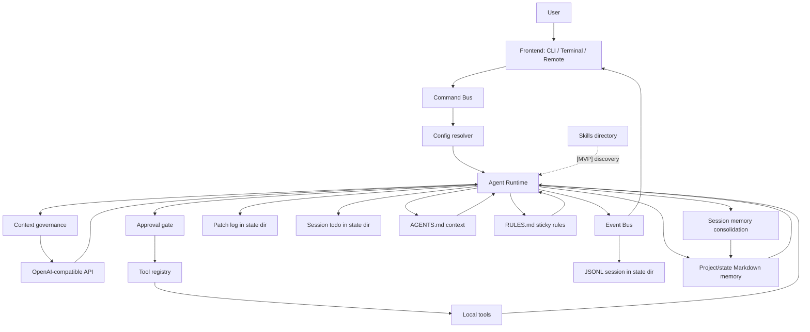

# Local Coding Agent 架构设计

更新时间：2026-07-17

本文档描述 `local-coding-agent` 当前架构基线，以及按技术成熟度划分的待加入能力。它是给后续实现者和协作 Agent 读取的架构视图；项目进度事实源仍以 `docs/project-status.md` 和 `docs/project-management.md` 为准。

2026-07-16 的 LCA / OMP / Codex 源码级对照与路线判断见 `docs/lca-omp-codex-architecture-comparison-2026-07-16.md`。

## 状态标签

| 标签 | 含义 | 架构处理方式 |
|---|---|---|
| `[CORE-已落地]` | 主链路稳定可用，有测试或真实运行验证。 | 作为后续设计依赖，不轻易推翻。 |
| `[MVP-已落地]` | 第一版已可用，但能力故意轻量。 | 允许按真实任务反馈继续增强。 |
| `[WIP-增强中]` | 局部能力已有，关键闭环还缺一段。 | 优先补齐闭环，不做大范围重构。 |
| `[NEXT-近期待加入]` | 与当前真实交付目标直接相关，设计已基本明确。 | 大猛或后续会话可直接按任务拆实现。 |
| `[LATER-后续候选]` | 有价值，但会显著增加复杂度。 | 先保留接口空间，不抢当前阶段。 |
| `[DEFER-暂缓]` | 方向合理，但当前收益不足或依赖条件不成熟。 | 不进入近期排期。 |
| `[OUT-阶段外]` | 与第一阶段本地、封闭 VM、单 Agent 边界冲突。 | 明确不做，除非项目目标改变。 |

## 架构目标

第一阶段目标是一个个人本地编程助手：

- 运行在本机或封闭 VM。
- 只访问用户指定的 OpenAI-compatible AI API。
- 能读取、搜索、修改本地代码。
- 能运行本地命令和测试。
- 能生成 diff，并把修改过程记录到本地 session。
- 能沉淀可审计的项目记忆。
- 默认不联网搜索、不自动下载依赖、不做远程控制、不做多 Agent。

### 产品北极星

LCA 的产品目标始终是**通用 Coding Agent**，不是需求审计器、代码证据报告器，也不是“拓展服务费结算”专用开发器。目标体验是：用户给出任意合理的软件需求后，Agent 能自主完成理解、探索、计划、编辑、测试、审查、交付和失败恢复，并在本地或封闭 VM 中保持权限可控、过程可审计。

- Codex 是 LCA **总体骨架的第一参考**：command/event protocol、Session/Turn/Step 生命周期、tool router、exec policy、sandbox、state/worktree、streaming 与多前端边界优先按 Codex 的 Owner 划分理解和演进。
- OMP 是 LCA **coding-agent 能力的第一参考**：agent loop/directive、provider 适配、hashline/edit、context compaction、approval 体验、memory/skills、task/advisor 和终端交互优先参考 OMP 的成熟实现。
- LCA 不照搬两者代码；保留 Python、本地优先、单 API、封闭 VM 友好和轻量部署的自身约束。
- 真实企业需求只作为验收样本和通用能力缺口探针，不得成为 Runtime 业务规则、关键词或专用 gate 的来源。
- 单个模型偶发失败不触发 Harness 增长；只有安全问题，或能在通用最小 fixture 中稳定复现的 Owner/lifecycle 缺陷，才允许修改核心能力。
- 若真实任务因工作量过大失败，优先拆成交付切片；若因业务证据或依赖不足失败，补输入或诚实 blocked，不用 Harness 猜业务事实。

核心约束：

- 本地优先：workspace 是默认安全边界。
- 单 Agent 优先：先把一个 Agent 的日用能力做稳。
- 可审计优先：写入、执行、审批、回滚都要有本地记录。
- OMP 思路本地化：吸收 approval、context compaction、default workflow、memory/skills 的成熟设计，但避免引入当前阶段不需要的外部依赖。

## 2026-07-16 架构校正

当前目标不再表述为“尽可能追平 OMP 的全部功能”，而是：

> Codex-first 核心骨架 + OMP-informed coding 能力 + LCA 自己的本地、封闭 VM、企业证据工作流。

建议目标分层：

```text
CLI / Terminal / Future TUI / Remote
                |
          Command + Event Protocol
                |
          Core Runtime
  Turn Loop / Tool Router / Session / Context
  Approval + ExecutionPolicy / Compaction / Hooks
                |
        Workflow Profiles
  coding | enterprise-evidence | readiness-audit
                |
       Tools / Skills / Agents / Extensions
```

架构约束：

- Core Runtime 只拥有 turn、tool、context、session、approval、deadline 和 protocol 生命周期。
- RequirementContract、Evidence Ledger、read-only reviewer、document consistency 与 SafePartialReport 保留，但逐步作为 profile-scoped workflow 接入；不再默认代表所有普通任务的停止条件。
- 安全/协议/工具结果配对可以 hard gate；语义质量默认 advisory，只有显式 profile 才成为 hard gate。
- 当前 LOC/method ceiling 继续作为只降不升的复杂度 ratchet，但不再把“文件低于某行数”当作 Owner 正确的充分证明。
- `run_tests` 是 exec-tier：无 shell 拼接和真实 exit code属于验证完整性，测试代码无副作用不属于其保证；真正隔离由未来 ExecutionPolicy/Sandbox Owner 提供。

### 参考实现决策

| 架构面 | 第一参考 | LCA 取舍 |
|---|---|---|
| Runtime、Session/Turn/Step、Command/Event | Codex | 逐步从当前 Runtime 抽出稳定生命周期与协议，不切换 Rust、不整体重写。 |
| Approval、ExecutionPolicy、Sandbox、State | Codex | 保留现有轻量审批，后续按独立 Owner 补执行隔离和可审计 action。 |
| Agent loop、ToolChoice directive、Provider 兼容 | OMP | 保留 OMP 的有界 continuation 和弱 provider 适配，不把 provider 特例散入 Runtime。 |
| Edit、Compaction、Memory/Skills、Task UX | OMP | 继续做适合 Python MVP 的裁剪实现；T-211 exact unique anchor recovery 是这一原则的实例。 |
| CLI/TUI/Remote | Codex 的协议分层 + OMP 的终端体验 | 前端只发 Command、消费 Event；完整 TUI 等 streaming 和 dispatcher 稳定后再做。 |

新能力进入排期前必须回答两个问题：它在 Codex 风格骨架中属于哪个生命周期/Owner，以及 OMP 是否已有可复用的 coding-agent 行为设计。两者都找不到依据时，先证明是通用需求，不能由单个 live 失败样本直接推动 Harness 增长。
- Frontend/Event 已完成事件数据形状、同步 CommandDispatcher、Turn correlation、provider streaming 和 terminal 增量渲染 MVP；worker/runtime 隔离、异步队列、取消和完整 TUI 仍是待加入能力，不能写成已经完全解耦。

### 模型语义与确定性边界

Codex 和 OMP 都把开放式用户语义交给模型、reviewer role 或显式结构化输入理解；确定性代码负责协议、权限、工具结果、diff、测试退出码和生命周期不变量。LCA 必须遵守同一边界：

- 不得用不断增长的中英文关键词、否定词表或正则，把“用户是否要求测试、实现、只读、证据”等开放自然语言直接提升为 hard gate。
- 确定性 gate 只消费可证明事实，例如工具调用及真实退出码、当前 diff、workspace/path、typed policy decision、结构化 reviewer finding。
- 用户语义需要跨组件传递时，优先原文保真交给模型；只有在上游已经产生显式 typed command/contract 时，下游才可做确定性消费，不能把同一套自然语言猜测换成 dataclass 后继续使用。
- 单个误判先归因 model/provider/tool/runtime/owner；与 Codex/OMP 对照后再决定是否修改 Harness。开放词汇问题即使出现多个例句，也不能靠枚举句式宣称闭合。
- 删除错误 hard gate 不等于削减能力。测试完整性继续由写后 `run_tests` 真实结果、`git_diff`、VerificationPlan、CompletionAudit 和结构化 reviewer 证明。

T-218 是这一规则的反例与纠偏记录：`requested_test_missing` 曾从 raw prompt 推断用户是否要求改测试；从裸子串扩展为中英文否定 grammar 后仍被“无需修改或新增测试”击穿。regex candidate 被拒绝且未进入 stable；R2 删除该自然语言硬门，同时保留真实写后测试与事实型 PatchReviewer，并已通过 immutable/live 回归发布。

## 总体分层

| 层 | 状态 | 职责 | 当前实现 |
|---|---|---|---|
| 用户入口层 | `[CORE-已落地]` | CLI、REPL、一次性 prompt、继续会话。 | `./agent`、`src/local_agent/cli.py`。 |
| 配置层 | `[CORE-已落地]` | 合并 CLI、环境变量、JSON config、provider preset、approval、summary、memory consolidation、预算、allowed dirs。 | `src/local_agent/config.py`。 |
| Agent Runtime | `[CORE-已落地]` | 模型循环、工具分发、deadline、synthetic tool result 与阶段编排；不再持有 prompt 投影、workspace roots、memory 归档、tool metadata、证据/verification/session-cache 或 session guard 窗口的具体实现。 | `src/local_agent/agent.py` 当前为 1,792 行、71 个方法的 orchestration facade；`workflow_profile.py` / `runtime_workflow_profile.py` 拥有 typed profile 解析与生命周期，其他 phase 通过显式 Protocol ports 协作，禁止 `__getattr__` service-locator 转发。 |
| Provider 层 | `[CORE-已落地]` | OpenAI-compatible chat completions 与 tool-call-safe streaming，对接百炼和通用 endpoint。 | `src/local_agent/llm.py` 负责请求适配，`src/local_agent/provider_stream.py` 单独拥有 SSE/JSON 解析、text/tool delta 分离和完整 tool-call 聚合。 |
| 工具系统 | `[CORE-已落地]` | 工具注册、schema、tier、approval policy、参数校验、错误包装。 | `src/local_agent/tools/base.py`。 |
| 本地工具层 | `[CORE-已落地]` | 文件、搜索、shell/test、git、patch、rollback、memory、learn、todo、ask_user。 | `src/local_agent/tools/`。 |
| 上下文治理 | `[MVP-已落地]` | OMP 风格 reserve、auto/local/llm summary、recent 保留、tool 输出截断、单 system message。 | `AgentRuntime._messages_for_model()` 编排，`src/local_agent/compaction.py` 承载纯函数。 |
| Context / Rules | `[MVP-已落地]` | Workspace roots、用户级/项目级 `AGENTS.md` 启动注入，`RULES.md` 每轮 sticky 注入；multi-root roots 也会进入关键工具观察。 | `src/local_agent/startup_context.py`、`--cwd`、`--allow-dir`、`~/.config/local-coding-agent/`、`.local-agent/`。 |
| 代码导航 / LSP | `[MVP-已落地]` | Python、Java、JS、TS、Vue 的 symbols/definition/references/diagnostics；可选外部 LSP server，缺失时回退 lightweight fallback。 | `src/local_agent/tools/lsp.py`、`src/local_agent/lsp/`。 |
| 本地持久化 | `[CORE-已落地]` | JSONL session、patch log、todo、Markdown memory。 | runtime state 默认在用户级 state dir；显式项目 memory/skills 在 `.local-agent/`，自动 consolidation 默认写 state memory。 |
| Memory / Skills | `[MVP-已落地]` | Markdown memory 启动注入、learn、可选 session memory consolidation 和 authored skills discovery 已落地；managed skills 待评估。 | `docs/memory-skills-implementation-plan.md`。 |
| Frontend / Event Protocol | `[MVP-已落地]` | 为 CLI、Terminal Frontend 和未来 Remote/Web 提供统一事件形状；完整解耦仍在进行。 | dataclass Event/Command Protocol、EventSink、session `event_v1`、CLI stderr renderer 和 terminal-native frontend 已落地；当前 terminal 仍直接持有 Runtime，`AssistantDelta`、Command Bus dispatcher 和 worker/runtime 隔离尚未落地。 |
| 项目管理视图 | `[CORE-已落地]` | Markdown 事实源和 Excel 人工视图。 | `docs/project-management.md`、同步脚本。 |

## 执行流程



## 已落地能力矩阵

| 能力域 | 标签 | 当前能力 | 架构说明 |
|---|---|---|---|
| CLI / REPL | `[CORE-已落地]` | 一次性 prompt、REPL、`--continue`、指定 session、隐藏工具日志。 | CLI 只负责输入和配置组装，业务逻辑留在 Runtime。 |
| Provider | `[CORE-已落地]` | `bailian`、`bailian-intl`、通用 OpenAI-compatible。 | 第一阶段只访问配置的 AI API，不加入公网搜索。 |
| Agent loop | `[CORE-已落地]` | 模型请求、工具调用循环、`finish_reason=length` 处理、deadline 停止、重复工具后强制最终回答。 | `max_steps=0` 默认不限步，靠时间预算和模型自然结束控制；重复同参工具命中阈值后，下一轮可发送 `tools=[]` 促使模型从已有证据回答。 |
| 默认工作流 | `[MVP-已落地]` | system prompt 和 runtime workflow nudge 会引导探索、todo、patch preview、验证、diff。 | 借鉴 OMP 分层设计，先用轻量 steering 替代完整 ToolChoiceQueue。 |
| 工具注册 | `[CORE-已落地]` | OpenAI function schema、运行时参数校验、tier 分类。 | tier 是 approval 的基础：read/state/interaction/write/exec。 |
| Approval | `[CORE-已落地]` | `always-ask`、`write`、`yolo`；每工具 `allow/prompt/deny`；session allow/reject；REPL `/approval`。 | 配置级 `prompt/deny` 是硬护栏，不被 session allow 绕过。 |
| 文件读取 | `[CORE-已落地]` | workspace 或显式 allowed dir 内读文件，返回 hash tag 和行号，限制大文件和二进制；展示单行最多 768 列并返回截断 metadata，完整文件 hash 不变。 | 写入前必须先读，给 anchored patch 提供校验锚点；超长/minified 单行不会吞掉上下文预算。 |
| Multi-root | `[MVP-已落地]` | `--allow-dir` / `AGENT_ALLOWED_DIRS` 显式授权额外目录，并把 workspace roots 注入模型上下文。 | 文件、搜索、LSP、patch 工具可访问额外目录；shell、git、project memory/skills 仍锚定 `--cwd`，session/todo/patch logs 和默认 consolidation memory 走 state dir。 |
| Anchored patch | `[CORE-已落地]` | `replace`、`insert_before`、`insert_after`、`dry_run`。 | 依靠 path、hash tag、line range、old_text 多重校验。 |
| Patch rollback | `[MVP-已落地]` | 回滚当前 session 中由 `apply_patch` 写入的补丁。 | 以 patch log 和 after tag 校验避免误回滚用户后续修改。 |
| 搜索 | `[CORE-已落地]` | `search_code` 调用 `rg`，结果使用 workspace 相对路径；单行按 512 列预览、每文件最多 20 个结果，并区分总结果、每文件和列宽截断。 | 参考 OMP `grep.ts` 的 `DEFAULT_MAX_COLUMN=512` 与 per-file cap；限制由工具 Owner 实施，不在主循环按文件名特判。 |
| Shell / Tests | `[CORE-已落地]` | `shell`、`run_tests`，带 timeout、budget clamp、危险命令拒绝。 | shell 不是沙箱，真正隔离依赖封闭 VM 和审批。 |
| Git | `[CORE-已落地]` | `git_status`、`git_diff`。 | 作为最终交付摘要和人工 review 的证据。 |
| Runtime state | `[CORE-已落地]` | `--state-dir` / `AGENT_STATE_DIR`，默认 `${XDG_STATE_HOME:-~/.local/state}/local-coding-agent/workspaces/<workspace-key>/`。 | 对齐 OMP，把运行转录与目标源码目录分层，避免只读跨项目分析污染目标仓库。 |
| Session | `[CORE-已落地]` | state dir 下的 `sessions/*.jsonl`，支持坏尾部恢复。 | session 是对话事实，不承担长期 memory 职责。 |
| Todo | `[MVP-已落地]` | `todo_read/add/update`，状态保存在 state dir 下的 session 维度。 | 用于长任务进度和 compaction 后恢复上下文。 |
| Startup context | `[MVP-已落地]` | 用户级 `AGENTS.md` 和项目级 `.local-agent/AGENTS.md` 启动注入。 | 常驻上下文是 advisory；项目上下文在用户上下文之后，更贴近当前 workspace。 |
| Sticky rules | `[MVP-已落地]` | 用户级 `RULES.md` 和项目级 `.local-agent/RULES.md` 在每次 provider request 前注入。 | 用于短规则，避免长会话/compaction 后丢失关键操作约束。 |
| ask_user | `[MVP-已落地]` | 支持 `timeout_seconds`、`default_answer`、deadline clamp。 | 只在需求歧义影响结果时使用。 |
| Context compaction | `[MVP-已落地]` | `auto/local/llm` summary，recent 保留，tool 输出只在发给模型副本中截断。 | 已支持字符预算和本地 token 估算预算，均保留 OMP reserve 思路；压缩、evidence 与 run collector 已分别拆到独立模块。 |
| LSP / Light fallback | `[MVP-已落地]` | symbols、definition、references、diagnostics、`lsp_status`。 | 默认 `AGENT_LSP_MODE=auto`：存在 root marker 和 server 命令时启用外部 LSP，否则回退本地静态导航；不自动下载依赖。 |
| Markdown memory | `[MVP-已落地]` | `memory_read/write` 读写项目 project/decisions/conventions/learned；启动时同时注入项目 memory 和 state memory。 | 当前用户指令和最新源码证据优先。 |
| Learn | `[MVP-已落地]` | `learn` 将可复用经验写入 `.local-agent/memory/learned.md`。 | tier=`write`，默认需要审批，不自动学习。 |
| Memory consolidation | `[MVP-已落地]` | `--memory-consolidation auto|llm` 在一轮结束后抽取 session 中的长期经验；默认 `--memory-scope state` 写 state dir 的 `memory/*.md`，显式 `project` 才写 `.local-agent/memory/*.md`。 | 默认 `off`；坏 JSON、空结果、预算耗尽或本轮已显式写 memory 时不写入。 |
| Authored skills discovery | `[MVP-已落地]` | 启动时扫描 `.local-agent/skills/<name>/SKILL.md`。 | 只注入 name、description 和 source path；正文按需用 `read_file` 读取。 |
| Frontend boundary | `[MVP-已落地]` | CLI、Terminal Frontend 和未来 Remote/Web 通过 Command/Event 协议接入 Runtime。 | Runtime 已开始产出 typed events；现有 CLI 输出由 `StderrEventSink` 渲染，Terminal Frontend 复用同一事件流。 |
| Run summary / coverage | `[MVP-已落地]` | 每轮结束写入 `run_summary` session 事件，并产出 `RunSummary` typed event。 | 记录 termination reason、耗时、LLM 请求数、工具调用/错误/无效结果、synthetic tool result、compaction、tool counts、guard hits 和 steering counts；`/status` 可查看最近一轮摘要。T-141/T-146 后还会单列 `provider_schema_violations`、`finalization_attempts`、forced-final protocol violation、markup artifact 与 suppressed execution；T-155 增加 `pre_review_audit` 的 rounds/categories/exhausted，T-156 增加安全部分交付的 emitted/observations/missing/rejected categories，方便区分安全终态与候选草稿。 |
| Verification Plan / Test Planner / Delivery Audit | `[MVP-已落地]` | `verification_plan.py`、`test_planner.py`、`verification_timeline.py`、`delivery_report.py`、CompletionAudit。 | 对齐 OMP queue/turn ownership：业务 contract 不能被任意工具代理事实自动标记完成；只有 path-related evidence、last effective write 的当前净 diff、post-write test、post-diff reviewer 可推进 delivery checks。未闭环写入以 `incomplete_delivery` 终止；每个有效写入的终态由 Runtime 追加变更路径、实际测试命令、diff/reviewer 和未闭环项，测试候选不直接执行、不绕过 approval。 |
| Session Evidence Continuity / User Facts | `[MVP-已落地]` | `session_evidence.py`、`runtime_evidence.py`、`user_facts.py`、`evidence.py`、RunSummary。 | 对齐 OMP session tool-result continuity：同一 Runtime 仅复用 fresh positive concrete-path read/search/LSP evidence，投影前逐路径 hash；negative/incomplete/global evidence 不跨轮复用。重复观测按 canonical path + query/range 替换。命名 session 跨进程恢复只接受重新从磁盘校验并重建的正向 `read_file` 证据；JSONL 中的 content/search/LSP payload 不被信任，且后台恢复只在当前 read policy 已预授权时执行，绝不打开审批 prompt。缓存命中后 ToolChoiceQueue 只发一次 soft directive，不移除 `read_file` schema；模型复读仍正常执行并单列 telemetry。 | write/rollback、workspace revision/root change、`/move` 或外部内容变化会失效；summary 以 `role=user` + `attribution=runtime` 发送，不能把混合摘要提升为 system。T-156 后成功 compaction 会把 summary + 有界最近消息安装为 active checkpoint，并在命名 session 恢复；同一未变化、仍超预算前缀只记 skip，不重复压缩。当前 Runtime facade 为 1,792 行、71 个方法，final-answer facade 为 59 行；architecture checks 锁定 Runtime 当前行数和方法数，并禁止领域 helper 回流。 |
| Epistemic negative-evidence taxonomy | `[MVP-已落地]` | `negative_evidence.py`、`steering/final_answer.py`、CompletionAudit、RunSummary。 | 对齐 OMP tool-result provenance 和 bounded continuation：一个 deterministic clause-local parser 产生 `asserted_absence`、`observed_no_match`、`epistemically_qualified`、`quoted_or_hypothetical`，消费者不再各自关键词扫描。绝对缺失需完整、未截断、同 scope 的 path/Git evidence；`observed_no_match` 也必须有本轮、同 root、匹配的真实观察，但不因此证明全局不存在；qualified/quoted 不补搜。root-local scope 不外推，multi-root 需覆盖多个 root。 | OMP `agent-loop.ts` / `tool-choice-queue.ts` 的终态 owner 与 active-tool 边界提供方向，不复制平台代码。session/RunSummary 记录 stance、blocked assertion/observation、qualified skip；live provider 的额外探索或文本质量仍作为 provider reliability 观察项。 |
| Read-only convergence | `[MVP-已落地]` | `temporary_tool_directive.py`、`runtime_tool_directive.py`、`task_contract.py`、`tool_choice_queue.py`、CompletionAudit。 | 临时 active-tool restriction 是 run-scoped directive，不是 raw allowlist：source 级 attempt/turn/outcome 显式 resolve/reject/exhaust，最终一次允许的发现工具执行后才可转入 `tools=[]` truthful final。`requirement_documents` domain 与 repository-code investigation 分离，持续只投影文档浏览、读取和澄清工具。 | 对齐 OMP `tool-choice-queue.ts` 的 in-flight/resolve/reject 以及 `agent-loop.ts` 的 per-turn active tools；LCA 的 document domain/audit 是本地增强，不宣称 OMP 有同名 contract。 |
| Isolated read-only reviewer / ExploreHandoff | `[MVP-已落地]` | `explore_handoff.py`、`read_only_reviewer.py`、`runtime_read_only_review.py`、`read_only_explore.py`、`runtime_read_only_explore.py`、`root_coverage.py`、`design_evidence.py`、`task_contract.py`、RunSummary。 | 高风险 read-only owner/impact/design contract 先产生 typed profile；reviewer 只通过 isolated output-only `submit_read_only_review` 提交结构化结论，不进入 ToolRegistry、approval 或工作区执行。T-192 收束 role/transport ownership，T-193 将 rewrite 后 fresh second reviewer 改为 deterministic advisory closure，T-194/T-195 将 targeted explore directive 与 semantic source candidate commit 收回 Queue/Explore Owner，T-196 通过 workspace evidence-root projection 区分授权根与代码证据根。 | 借鉴 OMP `tool-choice-queue.ts` 的 directive 生命周期、`agent-loop.ts` 的 turn boundary、`prompts/agents/explore.md` 的 alternate strategy、`tools/glob.ts` 的 bounded inventory 与 `yield.ts` 的结构化输出；LCA 的 document stance、isolated reviewer 和 multi-root evidence projection 是本地证据增强，不宣称 OMP 有同名 taxonomy 或 projection 类。 |
| Explicit read-only Explore Subagent | `[Phase 1-已落地，默认关闭；扩展暂停]` | `explore_subagent.py`、`config.py`、`runtime_prompt.py`、`tools/base.py`、`protocol/events.py`、`run_collector.py`。 | 显式 typed 配置才暴露每父 turn 最多一次同步 `delegate_explore`；child 使用独立 context/预算、同 canonical roots、精确只读工具白名单、禁止递归和 bounded typed yield。异常、timeout、malformed yield 与 interrupt 都闭合 SubagentStarted/Finished；child transcript、raw exception 和父 request/session/git/patch 字段不外泄。handoff 标记 `evidence_eligible=false`，父 Agent 必须直接复核关键事实。T-223 小 fixture 成功 handoff，但真实三仓场景中模型未选择已经暴露的 delegate，未证明收益。 | 对齐 OMP task/explore/yield 的 spawn-policy、tool boundary 与 typed handoff，以及 Codex AgentControl 的 lineage/权限继承；LCA Phase 1 保持同步、单 child、default-off。无收益证据前不实现 reviewer/implement、并发、写 Agent、worktree、resume、advisor 或完整多 Agent 调度，也不为模型选择概率增加 Queue gate。 |
| LSP semantic rename preview | `[T-224-已落地]` | 独立 `lsp/workspace_edit.py` 与 `tools/lsp_rename.py` Owner；复用 external LSP client、ToolRegistry、workspace roots 与 `apply_patch`。 | 外部 LSP 负责 `textDocument/rename`；Phase 1 只接受 text-only WorkspaceEdit，先全量校验 URI、authorized/project roots、UTF-16 range、重叠及文件/编辑/累计输入/输出预算，再在内存生成 bounded diff。preview 零写盘、零 patch log、`evidence_eligible=false`；parent 必须 read 候选文件，再用现有 patch/test/diff 闭环。真实 jdtls 样本已完成该生命周期。 | OMP rename 默认可 apply，并在 edits owner 中先验证全部 batch；LCA 暂无独立事务型多文件 writer，因此有意拆成 read-only preview + 既有 stale-safe patch。Codex 的 Tool Router/ExecutionPolicy/approval 用作边界参考。Phase 1 不支持 prepareRename、workspace/applyEdit、resource operation、自动应用或第二套 rollback。 |
| LSP Code Action preview / jdtls process boundary | `[T-226/T-228-已落地]` | 独立 `tools/lsp_code_action.py` Owner；复用 `lsp/client.py`、`lsp/config.py`、`lsp/workspace_edit.py`、ToolRegistry 和 ExecutionPolicy。 | `textDocument/codeAction` 只返回最多 20 个脱敏 metadata；指定 index 时允许一次 `codeAction/resolve`，仅对 text-only WorkspaceEdit 生成 bounded preview。Command、disabled、edit+command、resource operation、非 file URI、路径逃逸和非法 range 均 fail closed。T-228 为 jdtls child-only environment 固定 Eclipse metadata property=false，完整 typed server config 参与 client cache identity；parent env 与 non-jdtls 不变。 | 对齐 OMP codeAction literal/resolve 协议，但有意不复制 OMP 的 apply/executeCommand 路径。LCA 也不照搬 OMP 允许 language server 在源码根写 metadata 的边界；它只阻止已证实的 Eclipse metadata 副作用，不宣称 external LSP 受 OS sandbox 约束，也不清理 `target/classes` 等外部构建缓存。 |
| Requirement artifacts / safe partial delivery | `[MVP-已落地，live provider 待复测]` | `document_artifacts.py`、`tools/files.py`、`provider_context.py`、`requirement_evidence.py`、`safe_partial_report.py`、`runtime_read_only_review.py`。 | `RequirementContract` 为显式请求的 Markdown/HTML/image 建立 typed coverage：只接受成功 `read_file`/`inspect_image` 或 artifact-bound unavailable 边界；提及“未读图片”不会反向要求视觉读取。`read_file` 以有界 MIME header 返回图片 metadata；经 read-tier approval 的 `inspect_image` 仅在显式 `AI_VISION_MODEL` 和 8MB 限制内发起一次 vision 观察，base64 不进入 Evidence/session JSONL。需求引用接受路径加行号、页码或章节定位。第二次 reviewer non-pass、bounded explore hard-stop 或非 final terminal 都可由 Runtime 只用 typed handoff 生成安全部分交付：保留成功观察、未覆盖 root/范围与检查限制，绝不泄漏候选中的表、字段、接口、Owner 或数值推断。 | 对齐 OMP `tools/read.ts` 的 metadata handoff 和 `inspect-image.ts` 的独立 read/vision one-shot；LCA 不做 PDF/Word/browser，未配置 vision 能力时明确 `image_inspection_unavailable`。探索 attempts 与 successful observations 分开，synthetic suppressed call 保持 error 语义、不作为覆盖证据；安全部分交付是 LCA finalization owner 的本地增强，不是 OMP 同名能力。 |
| Provider terminal response recovery | `[MVP-已落地]` | `provider_terminal.py`、`runtime_provider_terminal.py`、`finalization.py`、RunSummary。 | 对齐 OMP `agent-session.ts` 对 empty assistant stop 的有界 retry 思路：普通或 forced-final turn 收到空、展示性或 detached placeholder 内容时，不持久化为 assistant final；最多三次 recovery 后明确 `provider_non_substantive_response`。正常 `null` 讨论、代码围栏和请求中出现的原词保持原样。 | 这是 provider-agnostic shape policy，不针对某个占位字符串；forced-final retry 仍保持 `tools=[]`，RunSummary 只记录 retry/exhausted 计数，不保存原始占位内容。 |

### T-157：Document Reconciliation Stance

多资料 document-consistency profile 下，reviewer 需要返回 `reported_unresolved`、`conditional_reconciliation`、`asserted_reconciled` 或 `explicitly_supported_reconciliation`，并以 handoff evidence ID 指向冲突资料和支持资料。`document_consistency.py` 只接受可见的、非视觉的 lifecycle/precedence excerpt 作为“已消解”支持；视觉模型输出只证明图上显示内容，不能证明作者意图、角色、生命周期或资料优先级。Runtime 会对候选做 clause-local cross-check，避免 reviewer 将仍含未限定调和断言的草稿伪报为 unresolved。第二次 non-pass 仍由 `SafePartialReport` 交付工具观察和未消解边界，不释放被拒候选。该 owner 边界借鉴 OMP reviewer/yield 的结构化 output 与 evidence-first image prompt 原则，但它是 LCA 的本地增强，不宣称 OMP 有同名 reconciliation taxonomy。

### T-158~T-188：Reviewer 生命周期与工具输出边界

T-158~T-187 不在 `agent.py` 叠加新的领域判断，而是让 document/reviewer 各阶段状态由其 Owner 记录和消费：claim/finding 有稳定 ID，重复 replay 幂等；rewrite 只有已排队且尚未消费的 transport recovery；final-submit 之外不能借 recovery 重开流程；unresolved/conditional/asserted reconciliation 按 clause-local 语义区分。T-188 则直接对齐 OMP 工具边界：`search_code` 在 `tools/search.py` 控制 512 列、每文件 20 个匹配和 typed truncation，`read_file` 在 `tools/files.py` 控制 768 列展示并保留完整 hash。两者都属于 tool-result shaping，不进入 Runtime guard。

当前 deterministic gate 为 1113/1113 tests、62/62 benchmark、22/22 architecture checks；T-233 stable release 为 `20260717T121435Z-0ab0cad1156a-c79a019a2d90`，revision `0ab0cad1156a9086180c6eeecd699f3eeaaa2231`，digest `c79a019a2d90bcbb660fa869781297f1e970ae0790f1c76ce4fadd9c977e07a8`。publish gate 在 clean detached candidate 中用 Python 3.14 再次通过 unittest、compileall 和 diff-check；独立 immutable matrix 另验证 provider error、timeout、step limit、command error 与未来非交付原因的写后延续、写前闭合，以及 RunSummary sink 故障时终态精确一次。该版本继承 T-228 的 semantic preview/jdtls 边界，并补齐同步 session task continuity。async queue、取消、OS sandbox、并发/写入 subagent、worker/runtime 隔离与完整 TUI 仍未实现，不冒充追平 Codex/OMP。

T-221 用该 immutable stable 完成 S6-S10 产品黑盒验收：stale read 后会重读当前 tag 并保留外部变更；approval reject 和 per-tool deny 无越权；跨进程 session 恢复保留目标/todo；需求变更后的实现、测试和 final 以最新条件为准。`TurnFinished.delivered` 表示 final transport 是否成功送达，不等同业务验收完成；S8C 虽为 `delivered=true`，RunSummary 仍记录 7 项 business acceptance 未验证、test plan blocked，正文明确未修改/未测试。该分层对齐 Codex 的 turn completion 与 task outcome 分离，不增加自然语言状态解析器。

T-222 已按最小共同不变量完成显式 Read-only Explore Subagent Phase 1。T-223 随后证明小 fixture 的成功 typed handoff 可用，但真实三仓 enabled 样本没有选择已暴露的 delegate，且与 default-off 一样未形成完整三仓直接证据；因此当前结论是安全机制成立、真实收益未证实。P14 保留 Phase 1 并暂停角色扩展，不通过 Queue 强迫 delegate，也不增加 reviewer/implement、并发、写入、worktree、resume 或 advisor。

T-224 已完成 LSP Semantic Rename Preview Phase 1。它不是第二套写工具：LSP 只负责语义定位和生成候选 WorkspaceEdit，新 Owner 先完整校验再返回 bounded preview；磁盘写入、审批、stale detection、rollback、测试和 diff 继续由现有 ToolRegistry/`apply_patch` 链路拥有。这样吸收 OMP 的 symbol-aware rename 价值，同时保持 Codex-first 的 Router/Policy 边界和 LCA 当前可审计写路径。

T-226 已完成 LSP Code Action Preview Phase 1。它复用 T-224 WorkspaceEdit Owner，不复制 parser、writer 或 rollback。初版虽然测试全绿，独立 OMP 对照仍发现 initialize 缺失 `codeActionLiteralSupport`，会让部分真实 server 只返回被 LCA 拒绝的 Command。R1 在 LSP client 协议 Owner 内补齐 capability，并用 in-flight server request 证明 resolve 期间不会被 `workspace/applyEdit` 绕过只读边界；没有增加 Queue gate、自然语言规则或新的执行生命周期。

T-227/T-228 完成真实收益与进程副作用闭环。真实 jdtls Code Action 修复缺失 import 的路径已证明有用；随后发现的 `.classpath/.project/.settings` 不是 WorkspaceEdit 或 command，而是 jdtls process 默认行为。T-228 将修复放在 LSP config/process Owner：child 环境追加 property=false，完整 `LspServerConfig` 成为 client cache identity，preview 文案只承诺 LCA 未 apply/execute。它没有向 Runtime、Queue、finalization 回流语义，也没有引入 watcher、cleanup、设置词表或第二 writer。外部 LSP 仍诚实标注为非 OS sandbox。

T-229 用 T-228 stable 对普通 coding 主链做跨语言黑盒校验：Python 单文件修复、Java/Maven 多文件实现与测试、Node 同 session 需求变更均自然完成 read/patch/test/diff，并由独立命令确认退出码与最终 diff。Java 的 malformed provider schema 在 ToolRegistry 前被抑制，Node 的错误 todo 调用只形成可恢复 tool error；两者都没有越权、错误写入或假交付，因此不新增 provider 样本 guard。`VerificationPlan.business_acceptance` 的 7 项固定来自 code-implementation contract 的 3 项 acceptance、2 项 evidence 和 2 项 verification，继续保持 human/oracle `unverified`；Runtime 只把真实路径证据、当前净 diff、post-write test 和 deterministic reviewer 记为 delivery checks。该分层对齐 Codex 的 turn completion/task outcome 分离和 OMP 的工具事实生命周期，不应为了终端数字好看把代理事实提升为业务验收。

T-230 随后验证当前 State/Worktree 最小边界，不先搬 Codex 的完整 worktree manager。run-start Git baseline 与 patch records 能把 unrelated dirty 文件和本轮修改分开；同一文件既有用户改动与本轮 patch 标记为 mixed；外部进程在 read 后修改并提交时，旧 content tag 先 fail closed，只有重新 `read_file` 取得新 tag 后才能写。第三类场景还证明外部 commit 成为新的 Git diff 基准，本轮 diff 只含 Agent patch。Case A 的模型连续生成不合法测试命令时，VerificationPlan 保持 test failed、Turn `delivered=false`，没有用独立可推导公式冒充测试事实。当前证据支持保留轻量 baseline/attribution/stale-safe 设计；是否增加 worktree 创建、隔离或管理 API，继续由真实并发/多任务需求驱动。

T-231/T-232 补齐同步中断后的 typed task continuity。Codex 保留 thread/turn state，OMP 在 external abort 时保留 steering queue；LCA 的每轮 RequirementContract/VerificationPlan 会重新建立，因此不能只靠下一句自然语言“继续”恢复未完成义务。新 `SessionTaskContinuityLifecycle` 只消费自身 typed event，并以 Git HEAD、canonical authorized path、session patch record 和当前内容 SHA-256 验证上一轮有效写入；fresh contract 只有 `unclear` 时才继承 code-implementation，显式 read-only 或新 code task 始终优先。继承只携带路径/hash/termination/run identity，不复用旧 tool/test 结果，也不把 raw prompt 下沉为关键词或正则。重复中断时 carried paths 与本轮有效 writes 先去重合并，再由同一 patch-record Owner 全量验证；任一外部 revision/content 变化均阻断交付。`agent.py` 只保留 import/init/resolve/revalidate/finish bridge，仍为 1,791 行/71 methods。

T-233 将 continuity 的终止判断收回 protocol lifecycle：唯一交付事实是 `TurnFinished.delivered`，Session Owner 不再维护 interrupt/budget/length 等开放原因集合。这样 provider error、LLM timeout、max steps、command error 和未来新增的非交付原因天然同构；是否延续仍由 code task、有效 patch record、HEAD/path/hash 新鲜度决定。CommandDispatcher 复用 Runtime summary owner，并在 RunSummary 已落盘但外部 sink 抛错时按 run identity 恢复原 reason/content，避免重复 final、summary、continuity 或 TurnFinished。该修复没有增加 Queue、reviewer、attempt、自然语言分类或新的 finalization owner；`agent.py` 保持 1,792 行/71 methods。

### T-192：Reviewer Role / Transport Ownership

T-192 将 reviewer role rejection、transport projection 与 proposal/pending/requirement/source finding 语义放回 read-only reviewer 和 transport Owner。它解决的是“建议/待确认/需求事实”被 reviewer 当成必须证明的现有实现，或 transport projection 丢失证据边界的问题。Runtime 只负责调用 facade 与记录 RunSummary，不在主循环识别业务词。

### T-193：Reviewer Advisory Closure

T-193 对齐 OMP reviewer/advisor 的有界 advice 思路：首次 isolated semantic review 仍是高风险 read-only gate；若 verdict=revise，primary rewrite 后不再运行 fresh open-ended semantic reviewer，以免移动目标。rewrite closure 由 deterministic owner 检查原 accepted findings 是否被删除或改变、claim projection/transport 是否完整、document consistency 是否仍合法。RunSummary 保留真实 reviewer verdict，不把 deterministic closure 伪记成 reviewer pass。

### T-194：Root-targeted Read-only Explore Directives

T-194 将 root-only broad inventory 与 precise source candidate 区分开。broad `glob_files` / inventory 只说明“看过路径列表”，不能直接生成强制 read shortlist；只有 root-targeted precise source candidate 才进入 bounded read directive。rule category 保持稳定，动态身份由 scoped paths、missing roots 和 requirement signature 承载。该设计参考 OMP ToolChoiceQueue 的 queued/in-flight/resolve/reject 生命周期，而不是让 Runtime 根据 provider 文本自动执行搜索。

### T-195：Semantic Source Candidate Commit

T-195 限定 semantic candidate 必须是真实 source path；CSS、图片、manifest/config 等搜索命中可以作为普通 evidence，但不满足 owner/design 的 code-root coverage。形成 semantic source candidate 后，Queue commit 到单一 target root 的有界 `read_file` requirement；detour 由 suppress/force lifecycle 收束。这样 provider 的参数方言仍在工具/schema owner 中 fail-closed，不需要 parser 解释 inner XML 或跨工具意图。

### T-196：Workspace Evidence Root Projection

T-196 明确三类 root：

- `authorized_roots`：WorkspaceContext 的授权边界，决定文件/search/LSP/patch 能不能访问。需求目录可继续属于 authorized roots。
- `code_evidence_roots`：owner/design profile 下可作为源码证据矩阵的代码仓库根，只由通用代码根 marker 和 typed projection 产生。
- `cross_root_coverage_roots`：需要在本轮只读审查中形成覆盖的代码证据根，来自 `code_evidence_roots`，不从所有 authorized roots 兜底。

这三者是角色投影，不是三套权限。inspection-forbidden 时投影为空；没有识别出 code root 时必须诚实报告未识别/未验证，不能把 Markdown/HTML/PNG 需求根当成源码根。OMP 源码只证明 session cwd/project context 与 ToolChoiceQueue directive 消费明确范围；LCA 的 multi-root projection 是本地授权模型下的增强，不宣称 OMP 有同名 `WorkspaceEvidenceRootProjection`。

## 待加入能力矩阵

| 能力 | 标签 | 建议落点 | 设计要点 | 验收标准 |
|---|---|---|---|---|
| Context token 预算 | `[MVP-已落地]` | Context governance。 | 已加入本地 token 估算、`context_token_budget` / `AGENT_CONTEXT_TOKEN_BUDGET` / `--context-token-budget`，字符预算保留 fallback。 | 长上下文压测中 compaction 触发更接近真实 context window；provider/model 专用 tokenizer 后置。 |
| Dynamic workspace roots | `[MVP-已落地]` | Frontend / Runtime / Context。 | T-128A 提供 session 级 `/workspace list/add/remove/reset` 与 `/add-dir`；T-128B 提供 OMP 风格 `/move`。追加 root 保持显式授权；move 迁移当前 session artifacts、重载新 primary 的 project context。 | 不重启 session 即可追加/移除 root、恢复动态 roots 或 move primary；move 后 shell/git/LSP/项目上下文一致切换，旧 primary 作为 session root 保留。 |
| 文件发现与负向证据可靠性 | `[MVP-已落地]` | Tools / Evidence / CompletionAudit / ToolChoiceQueue。 | T-132 已按 OMP `glob` / `grep` 职责拆分落地 canonical `glob_files`；截断和扫描范围进入结构化 evidence；“没有源码/目录不存在”必须由完整 path discovery 支持。inventory 先识别自然语言“盘点”意图，再把当前 active allowlist 投影到 provider schema；inventory 不复用自主小改的 candidate-read guard。 | 按文件名/扩展名可稳定发现；内容搜索 no-match、截断列表、primary Git 失败不再被误用为 additional root 的不存在证据；双 root live fixture 已 0 error 收束。 |
| Path-scoped rules | `[MVP-已落地]` | `path_rules.py` / Context / Rules。 | 每个 canonical root 的 `.local-agent/rules/*.md` 声明 root-relative glob、priority 和说明；metadata 每轮可见，正文仅对命中用户/工具路径加载。规则目录/文件均 strict-resolve 后验证仍位于 canonical root。 | 规则根隔离，外部/断裂 symlink 只产生诊断且绝不读取正文；add/remove/move 后重载，compaction 后仍动态注入；规则 advisory，不扩大工具权限。 |
| Stable / Dev release channels | `[MVP-已落地]` | `release.py` / `lca_release.py`。 | `lca` 运行完整验证后 promote 的 immutable source snapshot，`lca-dev` 运行当前 checkout；provider config 由用户级 config dir 共享。 | publish 前执行离线 unittest、compileall、diff check 与 source digest；失败保持旧 stable，snapshot 不携带 `.env`；支持 status/rollback。 |
| Offline benchmark / eval | `[MVP-已落地]` | `benchmark.py` / `benchmarks/tasks`。 | 默认 deterministic fake provider 在临时 fixture 上跑真实 Runtime；live provider 必须显式选择，live acceptance 使用 provider-neutral term/regex、root coverage 和禁止错误外推。 | JSON/Markdown 报告含 session/run、termination、LLM/tool、bounded redacted errors、guard、compaction effectiveness、验收、diff、测试证据和残余风险。 |
| Event Protocol v1 | `[MVP-已落地]` | `src/local_agent/protocol/events.py`。 | 使用 Python `dataclass` 定义 replayable events：`event_id`、`session_id`、`run_id`、`seq`、`timestamp`、`type`、`payload`；提供 `EventEmitter`、`EventSink`、`ListEventSink`、`StderrEventSink`。 | Runtime 已产出 `SessionStarted`、`UserMessage`、`LlmRequest`、`AssistantMessage`、`ToolStarted`、`ToolOutput`、`ToolFinished/ToolFailed`、`RunSummary`、`SessionFinished`；session JSONL 写入 `event_v1`；不引入 Pydantic。 |
| Command Protocol v1 | `[MVP-已落地]` | `src/local_agent/protocol/commands.py`。 | 定义 `SubmitPrompt`、`ApproveTool`、`RejectTool`、`SetApprovalMode`、`SetToolApproval`、`CancelRun`、`InterruptTool`、`ContinueSession` 的 dataclass command shape。 | 命令对象和 `to_dict()` 已可测试复用；完整 runtime command handler 留给 Terminal Frontend 接入时补齐。 |
| Terminal Frontend MVP | `[MVP-已落地]` | `src/local_agent/frontends/terminal/`、`src/local_agent/terminal_io.py`。 | 第一版选型为可选 `prompt_toolkit` + `rich`；定位是 terminal-native interactive frontend，不是 fullscreen TUI；保留原生 terminal scrollback，不做 OMP 级自研 renderer。 | `./agent`、`./agent --chat`、`./agent chat` 可进入同一套事件驱动交互入口；一次性 prompt / chat run 期间会静默 TTY echo，approval / ask_user 时恢复输入。 |
| Managed skills / autolearn | `[LATER-后续候选]` | Skills 子系统。 | 默认关闭；generated skills 与 authored skills 隔离，优先级最低，需审计。 | 不影响 authored skills，且能清楚区分人工与自动生成来源。 |
| LSP rename / code action | `[PHASE 1-已落地]` | LSP adapter 增强。 | 外部 server 已支持 rename 和 Code Action 的只读 preview；语义结果不写盘、不冒充 evidence，parent 继续走现有 patch/test/diff。 | auto-apply、executeCommand 和事务型多文件 writer 仍后置；先用真实语言服务器验证收益。 |
| AST edit / refactor | `[LATER-后续候选]` | Patch 层增强。 | 先保留 anchored patch 主路径，再评估 Python/TS 局部 AST 修改。 | 能降低大规模重构误改率，同时保留 diff 和回滚。 |
| Reviewer / planner 角色 | `[MVP-已落地]` | `planner.py`、`tool_choice_queue.py`、`completion_audit.py`、`patch_reviewer.py` 和 final steerers。 | 单 Agent 内部阶段化：先 explore，再写入；自主极小改动在读到源码+测试候选后进入 `candidate_committed`，收束为 preview/write/test/diff；写后以实际 diff/工具证据独立审查测试、调用方与实现质量，最后 CompletionAudit 收口；不引入多 Agent 并发。 | 高风险写入前后都有可审计的证据约束，真实小改持续复测。 |
| Remote/Web frontend | `[LATER-后续候选]` | `src/local_agent/frontends/remote/`。 | 等 Event/Command 协议稳定后再通过 JSONL replay 或 WebSocket 暴露；不进入第一版。 | CLI/Terminal Frontend 已证明协议可复用后，再接 remote/web。 |
| DAP | `[DEFER-暂缓]` | 调试工具层。 | 依赖语言生态和进程管理，当前收益低于 LSP / memory。 | 有真实调试场景后再设计。 |
| Browser / Web search | `[OUT-阶段外]` | 不加入第一阶段。 | 与封闭 VM、本地优先和无公网搜索目标冲突。 | 项目目标改变前不做。 |
| MCP / 插件市场 | `[OUT-阶段外]` | 不加入第一阶段。 | 会扩大外部依赖和权限面。 | 等本地核心稳定后重新评估。 |
| 自动下载依赖 | `[OUT-阶段外]` | 不加入第一阶段。 | 封闭 VM 场景下不可假设公网可用，也有供应链风险。 | 只允许用户显式安装或预置依赖。 |
| 远程仓库控制 | `[OUT-阶段外]` | 不加入第一阶段。 | 当前只做本地 git status/diff，不自动推送或开 PR。 | 需要单独权限模型后再议。 |

## 子系统设计

### Tool Approval

权限由三层叠加：

1. 全局模式：`always-ask`、`write`、`yolo`。
2. 配置级单工具策略：`tools.approval.<tool>` 或 `--tool-approval tool=allow|prompt|deny`。
3. 当前 session 临时策略：approval prompt 的 always allow / always reject，或 REPL `/approval`。

优先级原则：

- 配置级 `deny` 最高。
- 配置级 `prompt` 强制询问，不允许 session cache 绕过。
- session reject 高于 session allow。
- `yolo` 只跳过常规确认，仍受配置级 `prompt/deny` 和危险命令拒绝约束。

### Frontend / Event Protocol

下一阶段前端架构参考 OMP 的“runtime 与 TUI engine 分层”思路，但按 LCA 当前 Python Runtime 做本地化裁剪。T-076 已先落地协议与事件 sink，不急着引入 fullscreen UI：

```text
Frontend
  -> Command Bus
  -> AgentRuntime
  -> Event Bus
  -> Frontend
```

核心原则：

- Runtime 只产出 typed events，不关心 CLI、Terminal Frontend 或未来 Remote/Web 如何渲染。
- Frontend 只发送 typed commands 和渲染 events，不参与 Agent 决策、工具选择或上下文治理。
- Runtime 不直接 import `rich`、`prompt_toolkit`、Textual、Bubble Tea 或 Ratatui。
- 所有 terminal 输出集中到一个 renderer，避免 assistant delta、tool output 和用户输入互相冲掉。
- 第一版保持 append-only terminal transcript，保留原生 scrollback、copy/paste 和终端选择能力。
- 第一版不使用 fullscreen layout，不使用 Rich Live 作为主渲染循环，不做复杂 pane、mouse、overlay 或可交互 diff viewer。

Event Protocol v1 使用 Python `dataclass`，暂不引入 Pydantic。公共字段已落地在 `src/local_agent/protocol/events.py`：

```python
@dataclass
class BaseEvent:
    event_id: str
    session_id: str
    run_id: str
    seq: int
    timestamp: float
    type: str
    payload: dict[str, object]
```

`seq` 从第一版就保留，用于 session replay、远程 UI 同步、日志审计、断线重连和调试事件顺序。

第一版事件集合：

- `UserMessage`
- `AssistantDelta`
- `AssistantMessage`
- `ToolStarted`
- `ToolOutput`
- `ToolFinished`
- `ToolFailed`
- `ApprovalRequested`
- `ApprovalResult`
- `TodoUpdated`
- `ContextUpdated`
- `RunSummary`
- `SessionStarted`
- `SessionFinished`
- `ErrorEvent`

Command Protocol v1 至少包含：

- `SubmitPrompt`
- `ApproveTool`
- `RejectTool`
- `SetApprovalMode`
- `SetToolApproval`
- `CancelRun`
- `InterruptTool`
- `ContinueSession`

当前 `src/local_agent/protocol/commands.py` 已先固化这些 command 的 dataclass 和 JSON shape。T-077 已接入 terminal frontend；approval prompt 仍沿用同步 stdin 路径，但会产生 `ApprovalRequested` / `ApprovalResult` 事件，完整异步 permission command bus 后置。

第一版 Terminal Frontend 选型：

- `prompt_toolkit` 负责输入层：多行编辑、历史和快捷键；未安装时降级为普通 `input()`。
- `rich` 负责输出层：assistant message、tool timeline、error 和 approval result；未安装时降级为普通文本。
- `terminal_io` 负责运行期输入隔离：agent run 期间临时关闭 TTY echo，进入 approval / ask_user 时恢复输入并 flush 误敲缓冲，避免用户键盘输入混入工具日志。
- 建议入口命名为 `lca chat` 或 `local-agent chat`，避免 `tui` 一词让实现者误以为要做 fullscreen 重 UI。
- 后续只有当真实出现长会话渲染卡顿、复杂 pane/mouse、native binary 分发或 OMP 级终端控制需求时，才评估 Textual、Bubble Tea、Ratatui 或自研 renderer。

### Context Governance

当前实现采用 OMP 风格 reserve 思路：

- 小历史不压缩。
- 超过阈值后压缩早期历史，保留最近消息。
- 当前用户请求会被显式保留。
- 未完成 todo 会进入摘要。
- 大 tool 输出只在“发给模型的消息副本”中截断，session 原文保留。
- 默认 `summary_mode=auto`：触发 compaction 时尝试 LLM summary，失败回退 local summary。

已完成本地 token 估算 MVP。架构上不替换现有字符预算，而是在其上增加 token 预算；后续若引入 provider/model 专用 tokenizer，失败时仍继续回退字符预算。

### Context / Rules

当前上下文层参考 OMP 显式提供 cwd/project context 的思路，先把 workspace roots 写入模型上下文：

- Primary workspace：当前 `--cwd`。
- Additional allowed directories：每个 `--allow-dir` / `AGENT_ALLOWED_DIRS` 根，供 file/search/LSP/patch 工具使用。
- 对多目录任务，模型应先用 allowed dir 的绝对路径 `list_files/read_file/search_code`，不要猜 `requirements` 等目录。
- 因真实压测显示仅靠 system prompt 不足，`list_files {}` 的根目录输出、path-not-found 错误、带 allowed-dir 的空搜索结果也会提示 exact allowed dirs，让工具观察持续携带 OMP 风格运行时环境。
- 因真实压测继续显示“看到 roots 但仍不读需求文档”，需求/文档类任务会创建 OMP 风格 soft tool requirement：满足前只暴露 `list_files` / `read_file`，并要求先 `read_file` allowed-dir 下的候选需求文档；满足后恢复完整工具集。

动态 workspace roots 已完成 T-128 设计，详见 `docs/dynamic-workspace-roots-design.md`。核心边界是：

- `/workspace add` 只增加 session 级 additional root，不改变 primary workspace，也不加载该目录的项目 memory/skills。
- shell、git 和项目级上下文继续锚定 primary；写入继续受 approval policy 管控。
- `/move` 才切换 primary，并重载 startup context、sticky rules、project memory/skills、LSP 和 state artifacts。
- 不向模型暴露“自行扩大目录权限”的工具；root 变化只能来自用户前端命令。

T-132 已完成 roots 变更后的文件发现与负向证据闭环，详见 `docs/file-discovery-and-negative-evidence-design.md`：

- `glob_files` 只负责 filename/path discovery，`search_code` 只负责内容匹配，`list_files` 只负责附近目录浏览。
- 工具结果显式携带 scope、limit、truncated 和 complete/incomplete；模型不能把截断列表或内容搜索 no-match 当作路径不存在。
- workspace inventory 由 ToolChoiceQueue 按 canonical roots 有界覆盖；additional root 的 Git/shell 仍不自动放权，需要执行时使用 `/move`。
- 负向存在性结论进入 Evidence Ledger、CompletionAudit 和 FinalAnswerSteerer；工具调用证据也会与本 run 实际结果核对，最终回答不能声称未调用工具的结果。实现不得继续向 `agent.py` 堆独立 guard。

T-141 进一步把黑盒 multi-root finalization 的 owner 和 provenance 问题按 OMP 原则落回独立模块，而不是继续堆到主循环：

- `finalization.py` 的 `FinalizationCoordinator` 是 terminal phase 的唯一 owner，统一管理 forced-final、aggregate retry budget、unresolved gate 和 terminal draft reuse 规则。
- `chat_runtime.py` 为 provider `.chat(...)` 增加外层 timeout；普通与 forced-final 的主请求 `LlmError` 都经 terminal closure 写出 `final`、`run_summary`、`SessionFinished`，并区分 `llm_timeout` / `provider_error`。底层阻塞 worker 为 daemon，Runtime 可返回但不能在 Python 内强杀该 worker。
- `EvidenceLedger` / `ToolChoiceResult` / final steerers 对 path-based 证据保留 `root` + `scope` provenance；pinned requirement 也带相同归属。primary 的文档证据默认不跨 root 外推。
- provider 调用 active schema 外工具仍会被拒绝执行，但现在单独记为 `provider_schema_violation`，不再和普通 tool error 混在一起。
- T-146/T-147 将 forced-final 定义为 terminal-only：该 turn 的 active tools 为空；若 provider 仍回传 structured `tool_calls`，或百炼兼容层把完整、未围栏 `<tool_call><function=…>` 信封塞进 content，Runtime 不执行、不回显原始参数，写脱敏 `provider_protocol_violation` / RunSummary 后结束。普通 phase 的正常 structured tool call 仍可执行，但已分类的 text envelope 以 `provider_protocol_violation` 终止，不会静默作为最终文本展示；代码围栏/XML 示例保持原样。该边界借鉴 OMP 每 turn 的 active-tool / toolChoice owner 以及未执行 tool result 的显式终态处理，不复制其平台代码。
- T-147 的 Git metadata review-fix 对齐 OMP 的所有权边界而非增加最终文案关键词 gate：OMP 的 `packages/coding-agent/src/session/tool-choice-queue.ts` 管理 directive 的 in-flight / resolve / reject / `not_invoked` 生命周期，`packages/coding-agent/src/session/agent-session.ts` 在 `turn_end` 收束该 lifecycle 并将 active tool 集投影给 agent，`packages/agent/src/agent-loop.ts` 则在逻辑 turn 内处理 soft requirement 与 hard tool choice。LCA 保留 `RequirementContract` 这一裁剪增强层：先确认任务类型，再挂 Git metadata owner；`CompletionAudit` 将 `git_status` 归一为 typed primary observation（subject/root/value/provenance）。最终“是/不是 Git 仓库”与 observation 的极性核对是 LCA 附加审计，不声称 OMP 有同名 parser。

当前还有两类人工上下文文件：

- 用户级：`~/.config/local-coding-agent/AGENTS.md`、`~/.config/local-coding-agent/RULES.md`，可用 `AGENT_CONFIG_DIR` 改目录。
- 项目级：`.local-agent/AGENTS.md`、`.local-agent/RULES.md`。

加载语义：

- `AGENTS.md` 在新 session 启动时注入 system prompt，适合项目背景、个人偏好、常用流程。
- `RULES.md` 在每次发送模型请求前追加到 provider-bound context，适合“不要自动 commit/push”这类短而重要的 sticky rules。
- 两者都是 advisory guidance；当前用户指令和刚读取的源码证据优先。

### Memory / Skills

当前 memory 是启动上下文、手动工具和可选 session 整理：

- `memory_read` 读取项目 `.local-agent/memory/{project,decisions,conventions,learned}.md`。
- `memory_write` 追加结构化时间戳 note 到项目 memory。
- Runtime 初始化时读取项目 `.local-agent/memory/*.md` 和 state dir `memory/*.md`，并以 advisory block 注入 system prompt。
- `learn` 追加可复用 lesson 到 `.local-agent/memory/learned.md`。
- 可选 `memory_consolidation=auto|llm` 在一轮结束后让当前 provider 抽取长期 project/decisions/conventions/learned；默认关闭，开启后默认追加到 state dir `memory/*.md`，显式 `memory_scope=project` 才写项目 `.local-agent/memory/*.md`。

近期设计目标：

- Authored skills discovery 已落地，只曝光 name/description/source，正文按需读取。
- Path-scoped rules 已完成 MVP：每 root 使用 `.local-agent/rules/*.md`，metadata 常驻、正文按命中路径动态加载；详见 `docs/path-scoped-rules-design.md`。
- managed skills / autolearn 默认后置，避免自动生成内容长期污染 prompt。

### LSP / Light Fallback

LSP 按 OMP 的语言 client 思路拆成可选外部 adapter 和本地轻量回退：

- `AGENT_LSP_MODE=auto` 为默认：有 root marker 和 server 命令时使用外部 LSP；没有依赖时自动回退。
- `AGENT_LSP_MODE=light` 强制只用本地静态工具。
- `AGENT_LSP_MODE=external` 强制外部 LSP，不可用时报错，适合验证 VM 镜像依赖是否齐全。
- Java 默认找 `jdtls`，JavaScript/TypeScript 默认找 `typescript-language-server --stdio`，Vue 默认找 `vue-language-server --stdio`。
- Python 继续使用 AST 符号和 `compile()` 基础诊断。
- 外部 LSP 缺失时，Java、JavaScript、TypeScript、Vue 回退 regex/delimiter fallback，并在结果中标注 best-effort confidence。
- 限制扫描文件数、单文件大小、返回条数。

运行时不会自动下载 npm/maven/pip 依赖；封闭 VM 需要提前预置命令，或通过 `AGENT_LSP_*_COMMAND` 指向离线安装路径。

### Patch / Rollback

写入已有文件必须走 anchored patch：

```text
[src/app.py#1a2b3c4d]
10:def old():
11:    pass
```

修改参数：

- `path`
- `tag`
- `mode`
- `start_line`
- `end_line`
- `old_text`
- `new_text`
- `dry_run`

应用前校验：

1. 当前文件 hash 是否匹配 `tag`。
2. 指定行范围内容是否匹配 `old_text`。
3. `path` 是否在 workspace 或显式 allowed dir 内。
4. 写入工具是否通过 approval。

rollback 只回滚当前 session 的 patch record，并要求当前文件仍匹配写入后的 hash，避免覆盖用户后续修改。

## 第一阶段边界

第一阶段保留：

- CLI / REPL。
- OpenAI-compatible LLM。
- 单 Agent loop。
- 本地文件工具。
- 本地搜索工具。
- 本地 shell/test 工具。
- 本地 git status/diff。
- anchored patch / rollback。
- Markdown memory。
- 用户级/项目级 `AGENTS.md` 启动注入。
- 用户级/项目级 `RULES.md` sticky 注入。
- Markdown memory 启动注入。
- `learn` 工具。
- 可选 session memory consolidation。
- Authored skills discovery。
- Multi-root `--allow-dir`。
- OMP 风格 auto context compaction。
- 可选外部 LSP + 多语言静态回退。
- JSONL session。
- 默认工作流 system prompt / runtime nudge。

第一阶段不做：

- Browser。
- Web search。
- 外部 LSP server 作为默认强依赖。
- DAP。
- MCP。
- Subagents。
- 插件市场。
- 默认自动生成 skills。
- 自动下载依赖。
- 远程仓库控制。

## 推荐落地顺序

1. T-132 与 path-scoped rules 已完成；用 deterministic benchmark 和真实 provider fixture 继续量化 multi-root inventory、负向证据和小改闭环。
2. 在正确业务 owner root 补足 DDL、模板/下载中心或调用方证据，再用同一 session `/move` 做明确目标小改。
3. 只在真实失败样本证明需要时评估 managed skills、LSP rename/code action、AST edit、subagents 和更重的 TUI/Remote UI。
