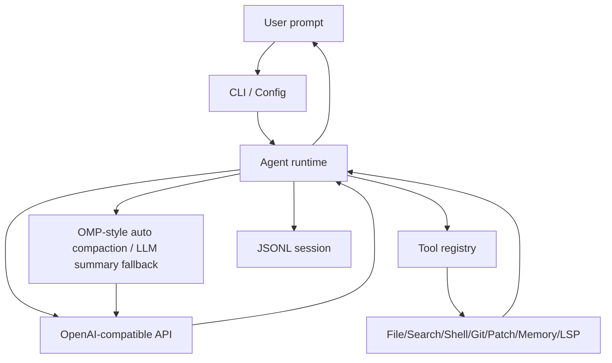

# 架构草案

## 第一阶段边界

保留：

- CLI；
- OpenAI-compatible LLM；
- 单 Agent loop；
- 本地文件工具；
- 本地搜索工具；
- 本地 shell 工具；
- 本地 git status/diff；
- 简化 anchored patch；
- Markdown memory；
- OMP 风格 auto context compaction；
- 轻量多语言静态代码导航；
- JSONL session。

不做：

- Browser；
- Web search；
- 完整外部 LSP server；
- DAP；
- MCP；
- Subagents；
- 插件市场；
- 默认自动生成 skills；
- 自动下载依赖。

## 执行流程



## Patch 设计

读取文件时返回：

```text
[src/app.py#1a2b3c4d]
10:def old():
11:    pass
```

修改时必须提供：

- `path`
- `tag`
- `start_line`
- `end_line`
- `old_text`
- `new_text`

应用前校验：

1. 当前文件 hash 是否匹配 `tag`；
2. 指定行范围内容是否匹配 `old_text`；
3. path 是否在 workspace 内；
4. 用户是否批准 write 操作。
