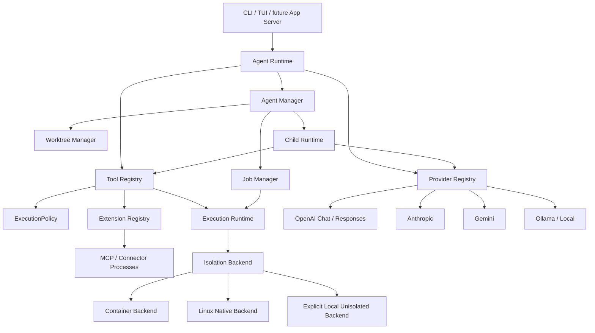

# LCA Platform Capabilities 100% Delivery Plan

更新时间：2026-07-29

## 1. 目标与 Deadline

本计划补齐四个领域：

1. 可证明的 OS 级执行隔离；
2. MCP / connector / plugin 扩展生态和首批通用工具；
3. 多 Agent、后台 Job 与 Git worktree 生命周期；
4. 多 Provider capability / transport registry。

最终 deadline：

**2026-09-30 18:00（Asia/Shanghai）**

这里的“100%”只表示本文冻结的 mandatory acceptance matrix 全部 PASS，不表示复制 Codex 或 OMP 的全部产品、云服务、私有协议和平台集成。任何 unsupported、INCONCLUSIVE 或依赖概率性 provider 才能成立的 mandatory case 都不能计入 100%。

## 2. 设计原则

- Codex-first：采用 Session/Turn/Tool、ExecutionPolicy、sandbox backend、App/Plugin 和 Agent lifecycle 的 Owner 分账。
- OMP-informed：采用 provider registry、extension wrapper、MCP discovery、task/job、browser/fetch 与 tool-result pairing 的成熟边界。
- LCA-local：保留 Python、本地优先、封闭 VM、单一 workspace authority、typed evidence、稳定发布和 fail-closed 特性。
- 不新增第二 approval、session evidence、workspace writer、process lifecycle 或 finalization tree。
- 不用命令关键词、自然语言、输出扫描或 basename 猜测安全属性。
- 不能证明 applied truth 的隔离 backend 必须标记 unsupported；不得把 approval、容器 CLI 存在或 wrapper 启动成功冒充隔离已应用。
- 默认能力不静默缩水。需要强隔离的任务显式使用 `required`；backend 不可用时零执行。
- `agent.py` 不增长。新领域进入独立 package，依赖只能朝平台 contract 和 protocol 层向内。

## 3. 总体架构



### 3.1 单一 Owner

| 领域 | 唯一 Owner | 禁止复制 |
|---|---|---|
| Tool schema、调用接纳、approval 接线 | `ToolRegistry` | plugin/MCP 自建 approval |
| 权限决策 | `ExecutionPolicy` | agent/job/provider 自建 policy |
| child process 启停、cancel、timeout、capture | `ExecutionRuntime` | backend/tool 各自 `Popen` lifecycle |
| 隔离配置与 applied proof | `IsolationBackendRegistry` | 根据命令或输出猜测隔离 |
| extension manifest/discovery | `ExtensionRegistry` | provider 或 Runtime 直接扫描 plugin |
| provider capability/transport | `ProviderRegistry` | Runtime 按 provider 名称分支 |
| agent/job 状态机 | `AgentManager` / `JobManager` | TUI 或 child Runtime 持有 lifecycle |
| workspace 写入 | 现有 patch transaction；worktree 内同样复用 | agent manager 直接写 primary |
| session/evidence | 现有 Session/Event/Evidence Owner | MCP/job/agent 新建平行日志树 |

## 4. OS 级执行隔离

### 4.1 用户合同

```text
isolation_mode: off | preferred | required
isolation_profile: read-only | workspace-write | danger-full-access
isolation_backend: auto | container | linux-native | local
network_policy: deny | allow
```

- `off`：保留现有本地执行，metadata 必须是 `unsandboxed`。
- `preferred`：有可证明 backend 时使用；否则明确提示并按 approval 决定是否退回 local，不得静默。
- `required`：backend 不可用、proof 不完整、workspace bind 不精确或 network policy 不可落实时零执行。
- `danger-full-access` 永远不称 isolated。

### 4.2 Backend

第一生产 backend 是 container backend，支持 Docker 或 Podman：

- `docker/podman create` 取得 opaque container identity；
- 在 start 前以 structured inspect 校验 image digest、workspace bind、rootfs readonly、network mode、capabilities 和 security options；
- 只有 proof 全部匹配才可 start；
- stdout/stderr、timeout、cancel、TERM/KILL 和最终 remove 仍由唯一 ExecutionRuntime 管理；
- credential 默认不进入 container；显式 env 必须经过现有 child-environment Owner；
- `read-only` 使用 readonly workspace bind；
- `workspace-write` 只给 primary workspace write bind，其他授权 root 默认 readonly；
- `network=deny` 使用 `none`；`allow` 不等于 unrestricted host network。

Linux-native backend 后续采用 bwrap/Landlock 的受支持组合。macOS Seatbelt 继续 unsupported，直到存在能在目标 exec 前向同一 process Owner 同步返回 apply 失败的公开 API。Mac 可使用 container backend。Windows native backend 不在本 deadline 的 mandatory platform 集合内，但 contract 和 unsupported behavior 必须完整。

### 4.3 Mandatory Acceptance

- backend installed、daemon unavailable、permission denied、invalid image、inspect mismatch 分别 typed fail closed；
- `required` 下所有 unavailable/unsupported case 零 child execution；
- read-only profile 无法修改 workspace；
- workspace-write 只能修改 primary workspace；
- sibling、home credential、state/session、Docker socket 默认不可见；
- network deny 的 DNS、TCP、loopback 均失败；
- timeout/cancel/parent exception 后 child/container 最终闭合；
- applied proof、backend、profile、network 和 image digest 进入 bounded metadata；
- raw credential、Docker auth 和完整环境不进入事件；
- local backend 始终报告 `unsandboxed`。

## 5. 扩展生态

### 5.1 Plugin 格式

```text
.local-agent/plugins/<plugin>/
  plugin.json
  skills/
  mcp/
  connectors/
```

Host 不 import 任意 plugin Python 代码。plugin 只能声明：

- skill metadata；
- MCP stdio server；
- connector endpoint metadata；
- namespaced tool/resource；
- 每个 tool 的 capability tier、schema、output budget 和 redaction policy。

所有 extension tool 必须先进入 `ExtensionRegistry`，再生成现有 `Tool`，最终仍由 `ToolRegistry` 做 schema validation、runtime allowlist、ExecutionPolicy、approval、event 和 result settlement。

MCP server 本身属于 exec action。安装或发现 manifest 不会自动启动 server；首次启动必须展示 exact command、cwd、plugin identity、声明的 filesystem/network capability，并经过现有 ExecutionPolicy。untrusted plugin 在 `required` isolation 下启动，server 进程不能因为其工具声明为 read tier 就绕过隔离。manifest tier 是审批和显示合同，不是对第三方代码无副作用的证明。

### 5.2 MCP / Connector

第一阶段支持 MCP stdio 的：

- initialize；
- tools/list、tools/call；
- resources/list、resources/templates/list、resources/read；
- cancellation、timeout、server exit、malformed correlation；
- bounded text/image result；
- session-scoped discovery selection。

HTTP/SSE MCP、OAuth marketplace 和远程自动安装后置，不进入本次 100%。

### 5.3 首批通用能力包

Mandatory first-party plugins：

- `fetch`：单 URL、redirect/size/content-type/source provenance 边界；
- `browser`：显式 launch/attach、tab lifecycle、read/screenshot/click/type；
- `github`：只通过 `gh` 或 GitHub connector，读写权限分 tier；
- `ssh`：显式 host profile、exec tier、无隐式 agent forwarding；
- `ast`：结构化 search/edit preview，写入仍复用 patch transaction；
- `dap`：launch/attach、breakpoint、stack、variables、continue/stop 的 bounded session。

### 5.4 Mandatory Acceptance

- manifest path、schema、duplicate namespace、symlink、special file fail closed；
- plugin disable/remove 不改变内置工具；
- extension 不可绕过 approval、workspace、output budget、credential redaction；
- MCP call id 与 result 精确关联，server crash/cancel 必须补 terminal result；
- malicious tool name/schema/result 不能污染其他 namespace；
- 六个 first-party plugin 各有 deterministic happy path、deny、timeout/cancel 和 malformed matrix；
- 默认无 plugin 时现有 LCA 工具能力和启动时延不回退。

## 6. 多 Agent、后台 Job 与 Worktree

### 6.1 Agent 模型

```text
AgentRole: explore | implement | review
AgentState: queued | running | waiting | completed | failed | cancelled | closed
```

- `explore`：只读，可共享 workspace snapshot；
- `implement`：必须使用独立 Git worktree，不得并发写 primary；
- `review`：只读消费 immutable commit/diff/test evidence；
- child 继承 provider registry，但使用独立 budget、context、tool allowlist 和 event correlation；
- parent 只消费 bounded typed handoff，不消费 raw child transcript；
- merge/cherry-pick 永远是父任务的显式 approval action。

### 6.2 Job 模型

- background process 由 JobManager 登记，实际 process 仍由 ExecutionRuntime 启停；
- job 有 owner agent、cwd、backend/profile、start/end、status/exit 和 bounded output cursor；
- wait、poll、cancel、close 幂等；
- session 结束时 running job 必须明确 retain 或 terminate，不允许 orphan-by-default。

### 6.3 Mandatory Acceptance

- 至少 4 个并行只读 agent；
- 至少 2 个并行 implement agent，各自独立 worktree；
- primary dirty/untracked 前后保持；
- agent/job cancel、timeout、provider failure、tool failure 全部闭合；
- worktree commit/diff/test evidence 可独立验证；
- conflicting commits 不自动合并；
- parent context 只进入 bounded handoff；
- resume/reopen 后状态不伪造 running；
- AgentManager、JobManager、WorktreeManager 无循环依赖，`agent.py` 不增长。

## 7. Provider 广度

### 7.1 Provider Contract

```text
ProviderDescriptor:
  id
  transport
  auth_scheme
  context_window
  tool_call_protocol
  streaming
  vision
  structured_output
  web_search
  prompt_cache
  reasoning
```

Runtime 只依赖 descriptor 和统一 stream events，不按 provider 名称判断行为。

### 7.2 Mandatory Adapters

- OpenAI-compatible Chat Completions（保留现有百炼）；
- OpenAI Responses；
- Anthropic Messages；
- Google Gemini；
- Ollama/local OpenAI-compatible。

每个 adapter 自己负责：

- request/message/tool schema 映射；
- stream parser；
- tool-call/result correlation；
- usage、request id、finish reason；
- retryable/non-retryable error taxonomy；
- provider-native history payload；
- capability downgrade 的 typed 说明。

### 7.3 Mandatory Acceptance

- 五个 adapter 的 deterministic stream/tool/malformed/cancel/timeout matrix；
- provider 切换不改变 ToolRegistry 和 ExecutionPolicy；
- 不支持的 vision/web/tool/structured capability 在 request 前 fail closed；
- provider credential 不进入 child、plugin、session raw event；
- retry 只覆盖明确 retryable transport/status，不重放已结算 tool side effect；
- compaction 和 context reserve 消费 descriptor，不用 provider 名称猜测；
- 至少百炼、OpenAI、Anthropic、Gemini 各一份 live smoke；外部服务不可用时该 adapter 不能计为 100%。

## 8. 依赖方向

```text
protocol <- execution/contracts <- execution/backends
protocol <- providers/contracts <- providers/adapters
protocol <- extensions/contracts <- extensions/mcp|plugins
protocol <- agents/contracts <- agents/manager|jobs|worktrees

tools -> execution/contracts
runtime -> providers/contracts
runtime -> agents/contracts
extensions -> tools/base

禁止：
execution -> runtime
providers -> tools
plugins -> agent
agents -> frontend
```

## 9. 里程碑

| 里程碑 | Deadline | 交付 |
|---|---:|---|
| T-272 Architecture Contract Freeze | 2026-07-31 | 四领域 contract、Owner、config schema、acceptance fixtures |
| T-273 Container Isolation Phase 1 | 2026-08-14 | container backend、required fail-closed、filesystem/network/process matrix |
| T-274 Provider Registry Phase 1 | 2026-08-28 | descriptor + 五 adapter + deterministic/live gates |
| T-275 Extension Runtime Phase 1 | 2026-09-11 | plugin manifest、MCP stdio、connector boundary |
| T-276 First-party Capability Pack | 2026-09-18 | fetch/browser/github/ssh/ast/dap |
| T-277 Agent/Job/Worktree Phase 1 | 2026-09-25 | parallel agents、jobs、isolated worktrees、handoff |
| T-278 Integration / Stable Release | 2026-09-30 18:00 | full gates、clean immutable candidate、independent verifier、stable |

### 9.1 外部前置

这些前置不写入仓库，也不能由测试替代：

| 前置 | 最晚可用时间 | 未满足结果 |
|---|---:|---|
| 可运行的 Docker 或 Podman daemon、固定测试 image digest | 2026-08-03 | T-273 真实隔离矩阵 INCONCLUSIVE，不能发布 |
| OpenAI、Anthropic、Gemini 的独立测试 credential | 2026-08-20 | 对应 live smoke INCONCLUSIVE，Provider 100% 不成立 |
| 可控 GitHub 测试仓库与 SSH 测试 host | 2026-09-01 | github/ssh plugin 只能完成 deterministic gate，不能计 100% |
| 可运行 Chromium、AST/DAP fixture | 2026-09-01 | browser/ast/dap mandatory matrix 不完整 |

credential 只进入进程环境或显式 secret store，永不写入本计划、plugin manifest、session event、candidate 或 verifier artifact。

## 10. Release Gate

最终 100% 需要同时满足：

- 本文全部 mandatory acceptance PASS；
- 现有 unittest、benchmark、architecture、compileall/diff/help/chat 全绿；
- 普通 Coding 0-to-1、1-to-10、dirty-worktree、multi-root 和 long-session 回归不缩水；
- clean detached physical immutable candidate；
- 至少一份独立 deterministic verifier；
- 隔离 backend 做真实 filesystem/network/descendant/cancel matrix；
- 四个外部 provider live smoke；
- MCP malicious server、plugin boundary 和 agent/worktree failure matrix；
- stable 发布后安装、升级、回退和 source identity PASS；
- `residual_subagents=0`。

若 deadline 当天仍有任一 mandatory case FAIL 或 INCONCLUSIVE，状态必须是未完成，不能通过删除 case、改名或降低默认能力宣称 100%。
